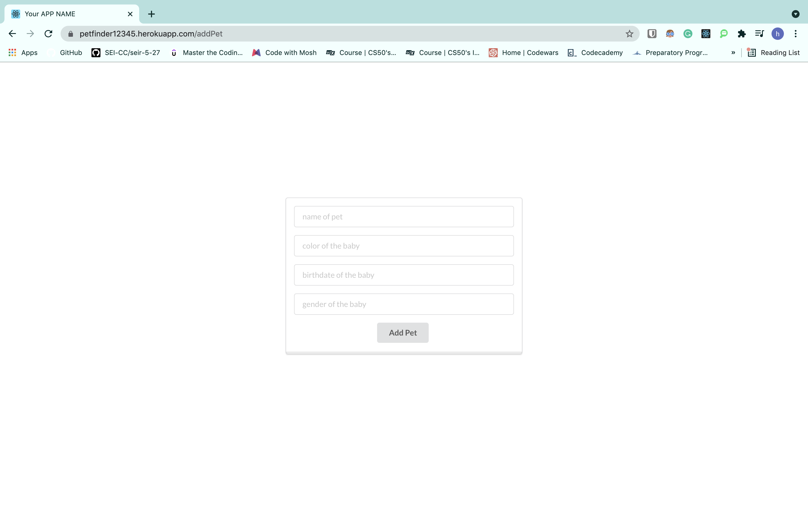
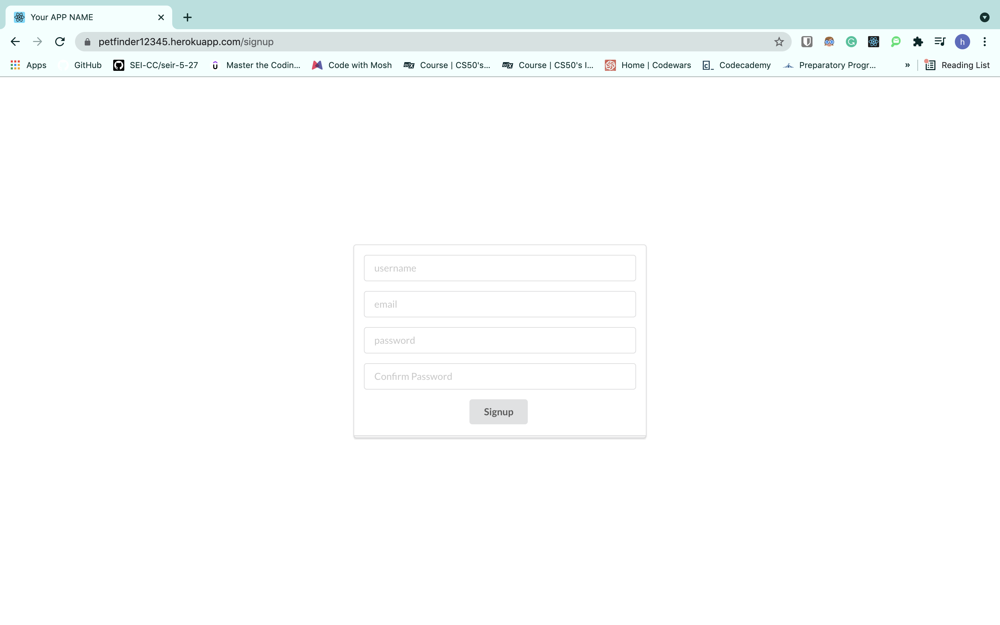

Pet Finder

The purpose of this application is to connect pet rescues and potential adopters in order to find a home for the pet. Adopters can view various pets and choose which one they feel will fit them the best based on their personality, color, sex, etc. They can then inquire about the pet directly with the rescue. 

Technologies Used

HTML, CSS, React, Javascript, Node.js, Express, Git, Github

Heroku

https://petfinder12345.herokuapp.com/

Trello

https://trello.com/b/K6gEUIUf/pet-finder

Icebox

More complete styling, Add pictures for each pet, The ability for a potential adopter to send an inquiry form, The ability for an adopter to save or 'heart' pets they like so they can keep track of them in a seperate library. 